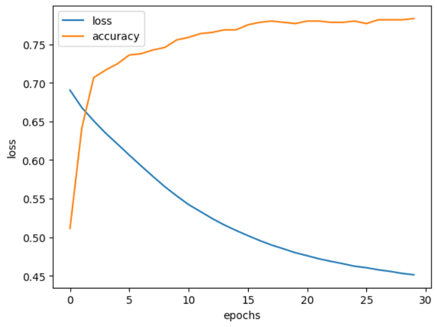

# Diabetes Prediction


This is a machine learning project aimed at predicting the occurrence of diabetes based on patient data. The project employs various machine learning modeling techniques, including Random Forest, Support Vector Machine (SVM), Neural Network, and K-Nearest Neighbors (KNN).

## Prerequisites

Before running the code, make sure you have the following Python libraries installed:

- pandas
- matplotlib
- numpy
- scikit-learn
- tensorflow

You will also need the "diabetes.csv" dataset to run the code. Ensure that the CSV file is in the same directory where you are running the code or provide the full path to the file.

## How It Works

The code performs the following steps:

1. Loads the "diabetes.csv" dataset using the Pandas library.
2. Splits the data into features (x) and labels (y).
3. Divides the data into a training set and a test set.
4. Standardizes the data using StandardScaler.
5. Trains a Random Forest model to predict diabetes occurrence and evaluates its accuracy.
6. Utilizes an SVM model with 10-fold cross-validation and calculates the average accuracy.
7. Creates a simple neural network with TensorFlow and trains the model for 30 epochs.
8. Makes predictions with the neural network and calculates its accuracy.
9. Uses a KNN model to predict diabetes occurrence and evaluates its accuracy.
10. Plots the loss history of the neural network.



## Results

The code provides the following outputs:

- Accuracy of the Random Forest model.
- Average accuracy of the SVM model with cross-validation.
- Accuracy of the neural network.
- Accuracy of the KNN model.

## How to Run

You can run the provided Python code in your preferred development environment. Ensure you have the aforementioned libraries installed and that the "diabetes.csv" file is in the working directory.

```bash
diabetes_prediction.py
```
